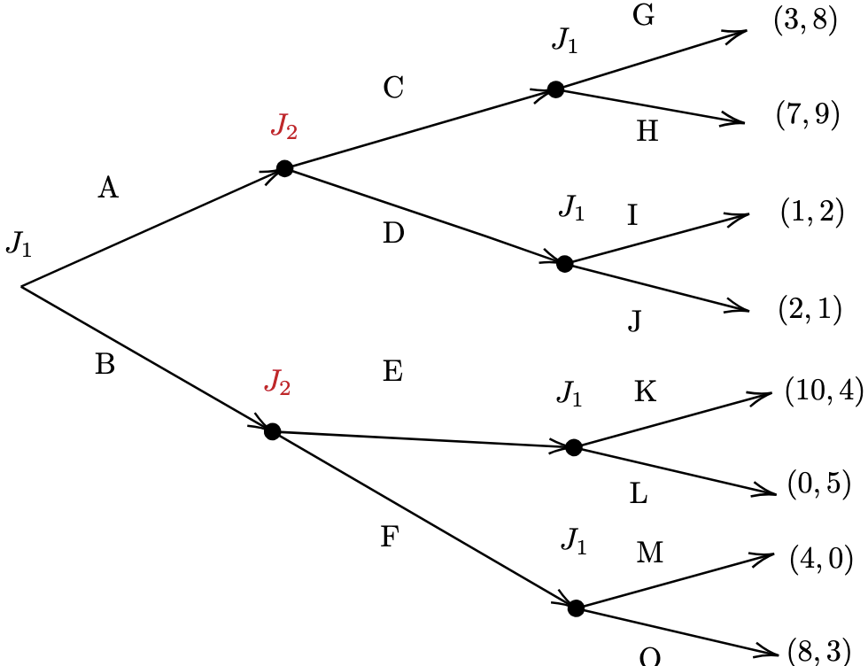

<!-- _class: "title-academic" -->
<!-- _backgroundColor: white -->

Introducción a la Teoría de Juegos

Estrategia, Racionalidad y Equilibrio

Carlos A. Yanes Guerra

Barranquilla, 2025

Universidad del Norte - Departamento de Economía

---
<!-- _class: title -->

# Curso de teoría de **Juegos** 

## Microeconomía II | **Uninorte**

---
<!-- _class: toc  -->

1. [Inicio](#1)
2. [Contenido](#3)
3. [Ingredientes](#7)
4. [Vamos con todo](#11)
5. [Elija](#14)
6. [Tipos de Juego](#24)
7. [Referencias](#30)

---
# Esta clase no trata de
<!-- _class: "multicolumn" -->

  
   
  

  
   
  

---
# Si no mas bien de:

<figcaption align="center"> <i>Preguntas y preguntas</i> Interacción.</figcaption>

## Rol de las personas

En realidad juega roles en *diferentes* **juegos**

- Familia
- Amigos
- Compañeros de clase
- Conduciendo
- Empleador
- Reputación
- Conmigo

> Todo el tiempo usted está jugando

---
# Juegos no solo tiene que ver con **Economía**

- Naturaleza
- Derecho
- Deportes
- Biología
- Ciencias Políticas

---
<!-- _class: chapter -->

# Ingredientes

## Lo que matemáticamente requiere
---
# Definición

- Un `juego` puede ser descrito como
$$\Gamma = (s_1,s_2, \cdots, s_n;u_1, u_2, \cdots, u_n):$$

Donde **habrá**:

1. Jugadores $i \in \{1,2,\cdots, N\}: N \geq 2$
2. Conjunto de estrategíaa $s_i \in \{S_i\}$
  - $S_i$ i es el espacio estrategico del **jugador** $i$
3. Los pagos/recompensa $u_i \in \{s_i, s_{\neg i}\}$
  - $u_i: S_i \times S \cdots S_{\neg i} \rightarrow \mathbb{R}$

---
<!-- _class: "nobrand" -->
<!-- _backgroundImage: url('https://media0.giphy.com/media/v1.Y2lkPTc5MGI3NjExdnFmeWMxem9keDJxeTFlank1ejFzdTJsdDh3cHoyN3B4ODJwdmxnayZlcD12MV9pbnRlcm5hbF9naWZfYnlfaWQmY3Q9Zw/TIRlx3Fzi1A7L2d5z7/giphy.gif') -->
<!-- _backgroundSize: cover -->
<!-- _backgroundPosition: center -->

---
# Ahora que lo he asustado

## Esto puede ser abstracto

- En esta clase utilizaremos algunas cosas de matemáticas, pero no va ser todo.

- No va tener ningún problema si sabe:
    - Hacer álgebra simple.
    - Calcular un promedio o un valor esperado.
    - Derivar.

- Aunque no sea así, podrá ponerse al día.

- Me voy a centrar en aplicaciones y ejemplos de **interacción estratégica**.

---
<!-- _class: chapter -->

# Vamos con **todo!!**

## A lo que vinimos

---

# Qué define entonces un juego?

<figcaption align="center">Definición de juegos.</figcaption>

# Definición

Un **Juego** es una situación en la que los *jugadores* toman **decisiones estratégicas** donde se tienen en cuenta las acciones y las respuestas de los demás.

- **Recompensa**: Pagos o utilidad 
- **Reglas**: Planes de acción que tienen los individuos para jugar.
- **Jugadores**: Personas | instituciones | naturaleza
- **Consecuencias**: Valores de resultados posibles de una interacción estratégica.   

---
# Vamos a empezar primero con un juego

### Actividad: A o B – tentación vs. coordinación

`Objetivo`: decidir en secreto entre A o B. Será emparejado al azar con otra persona del salón (no sabrá quien le corresponde). *El papel debe tener solo la letra que elige y su nombre y apellido*.

#### Reglas

Consecuencias de puntos (bonificación sobre el examén final):
	•	Si tú eliges A y tu pareja elige B → tú ganas +10 puntos y tu pareja 0.
	•	Si ambos eligen B → +2 para cada uno.
	•	Si ambos eligen A → +1.

---
<!-- _class: chapter -->

# Elija **YA!!**

## Ya veremos que pasa

---
# Ejemplo de forma normal

- Vamos a ver primero como se arma el Juego Propuesto
> La forma normal de un juego es como una matriz cuadrada.

<h3 style="text-align:center; color:#000;">Jugador 2</h3>

<table style="margin:auto; border-collapse:collapse; text-align:center; font-size:22px; border:1px solid #000;">
  <tr>
    <th style="border:none;"></th>
    <th style="border:none;"></th>
    <th style="background-color:#c62828; color:white; border:1px solid #000;">A</th>
    <th style="background-color:#c62828; color:white; border:1px solid #000;">B</th>
  </tr>
  <tr>
    <th rowspan="2" style="background-color:#c62828; color:white; border:1px solid #000; padding:5px;">Jugador 1</th>
    <th style="background-color:#c62828; color:white; border:1px solid #000;">A</th>
    <td style="border:1px solid #000; width:100px;">1 , 1</td>
    <td style="border:1px solid #000; width:100px;">10 , 0</td>
  </tr>
  <tr>
    <th style="background-color:#c62828; color:white; border:1px solid #000;">B</th>
    <td style="border:1px solid #000;">0 , 10</td>
    <td style="border:1px solid #000;">2 , 2</td>
  </tr>
</table>
<figcaption align="center"> <i>Matriz de Juego</i> forma normal.</figcaption>

---
# Por qué lo anterior es un **Juego**?

### Varias razones

- Hay más de un jugador.
- Existen estrategias disponibles para cada jugador.
- Los pagos se determinan conjuntamente por las estrategias elegidas.
- Usted no sabe quién es el otro jugador, pero aun así debe pensar en cómo responder a sus estrategias con las propias.

---

# Como resolver lo anterior

- Flujo de **actividad** que se usa en **juegos** para responder.

  Jugador
  ⟶
  Qué juega?
  ⟶
  Compare

  De tal manera que:

  <box>Toma filas</box>
  ⟶
  <box>compara los pagos</box>
  ⟶
  <box>Elige</box>

<footnote> *Nota: Cuando juega el jugador (2) la comparación la hace por columnas

</footnote>

---
# Volvamos a la **matemática**

## Estrategias estrictamente dominantes (E.E.D)

- Son aquellas estrategias que **sin importar** que haga otro jugador (contrario), siempre su Utilidad es **mayor** que cualquier otra estrategia del propio jugador.

$$U(s_{i},s_{-i})>U(s^{*}_{i},s_{-i})$$

*El signo de la ***desigualdad*** es preferente* (A es mas preferido que B)
    
> Piense en que si a usted le gusta la pizza mas que la hamburguesa, siempre escogerá pizza.

---
# Resolviendo el juego

### Mire a continuación:

Elegir **A** vs elegir **B** *(sin importar que juegue el otro)* $\Rightarrow$
$$\text{Estrategia A da pagos de}\;: \color{blue}{1} \quad \color{blue}{10}$$

VS

$$\text{Estrategia B le da pagos de}\;  \color{red}{0} \quad \color{red}{2}$$

---
# Esto es

<h3 style="text-align:center; color:#000;">Jugador 2</h3>

<table style="margin:auto; border-collapse:collapse; text-align:center; font-size:22px; border:1px solid #000;">
  <tr>
    <th style="border:none;"></th>
    <th style="border:none;"></th>
    <th style="background-color:#c62828; color:white; border:1px solid #000;">A</th>
    <th style="background-color:#c62828; color:white; border:1px solid #000;">B</th>
  </tr>
  <tr>
    <th rowspan="2" style="background-color:#c62828; color:white; border:1px solid #000; padding:5px;">Jugador 1</th>
    <th style="background-color:#c62828; color:white; border:1px solid #000;">A</th>
    <td style="border:1px solid #000; width:100px;">
      1 , 1
    </td>
    <td style="border:1px solid #000; width:100px;">
      10 , 0
    </td>
  </tr>
  <tr>
    <th style="background-color:#c62828; color:white; border:1px solid #000;">B</th>
    <td style="border:1px solid #000;">
      0 , 10
    </td>
    <td style="border:1px solid #000;">
      2 , 2
    </td>
  </tr>
</table>

<figcaption align="center"><i>Comparación Jugador 1</i> forma normal.</figcaption>

# Tip :dart:

Note que quien **mejor** pagos :moneybag: da es jugar la estrategia **A**, aunque las consecuencias no sean las deseadas. El equilibrio es individualista.

---

# Para el jugador B

<h3 style="text-align:center; color:#000;">Jugador 2</h3>

<table style="margin:auto; border-collapse:collapse; text-align:center; font-size:22px; border:1px solid #000;">
  <tr>
    <th style="border:none;"></th>
    <th style="border:none;"></th>
    <th style="background-color:#c62828; color:white; border:1px solid #000;">A</th>
    <th style="background-color:#c62828; color:white; border:1px solid #000;">B</th>
  </tr>
  <tr>
    <th rowspan="2" style="background-color:#c62828; color:white; border:1px solid #000; padding:5px;">Jugador 1</th>
    <th style="background-color:#c62828; color:white; border:1px solid #000;">A</th>
    <td style="border:1px solid #000; width:100px;">
      1 , 1
    </td>
    <td style="border:1px solid #000; width:100px;">
      10 , 0
    </td>
  </tr>
  <tr>
    <th style="background-color:#c62828; color:white; border:1px solid #000;">B</th>
    <td style="border:1px solid #000;">
      0 , 10
    </td>
    <td style="border:1px solid #000;">
      2 , 2
    </td>
  </tr>
</table>

<figcaption align="center"><i>Pagos de jugador 2</i> forma normal.</figcaption>

# Qué pasó? :warning:

El jugador (2), tambien hace lo mismo y compara (*lo hace de tal manera que es vertical*). El va elegir lo **mejor** para él. En este caso va elegir **A** y el equilibrio que vamos a tener es (**A,A**)

---
# Forma Extensiva

<!-- _class: "white-slide" -->

### Algunos Juegos se pueden representar

- De forma de **árbol**
- Los jugadores juegan en nodos
- Puede hacerlos vertical u horizontal
- Tienen formas o algortimos para resolverlo

---
<!-- _class: "white-slide" -->
# Resultados obtenidos

---

Lo anterior se conoce como   "**Dilema del Prisionero**"

---
<!-- _class: chapter -->

# Tipos de Juego

## Otras formas de jugar

---

# Tipos de Juegos

<!-- _class: "white-slide" -->

# Juegos Cooperativos :handshake:

 Los agentes pueden **negociar contratos** vinculantes que permiten adoptar estrategias conjuntas. 

# Juegos No Cooperativos :crossed_swords:

No es posible **negociar contratos** vinculantes. 

---

# Tipos de Juegos

<!-- _class: "white-slide" -->

# Juegos simultaneos :game_die:

Los agentes juegan **a la misma vez**.

# Juegos secuenciales :trophy:

Los jugadores juegan o hacen una movida **una vez** y luego debe esperar la reacción de otro *jugador*. *Puede ver que ha hecho otro anteriormente*

---
# Juego **Secuencial**

<!-- _class: "white-slide" -->

---
# Otros tipos de **Juegos**

<figcaption align="center"> <i>Juegos de tablero</i> Interacción.</figcaption>

Hay variedad de formas de jugar juegos.

- Juegos de un solo momento, juegos repetidos, juegos *infinitamente* repetidos.

- Juegos de confianza 

---

# Otros tipos de **Juegos**

<figcaption align="center"> <i>Juegos reales</i> Suma Cero.</figcaption>

Hay estilos que la ganacia de un jugador es la perdida del otro

- Juegos de Suma Cero 

<h3 style="text-align:center; color:#000;">Portero</h3>

<table style="margin:auto; border-collapse:collapse; text-align:center; font-size:22px; border:1px solid #000;">
  <tr>
    <th style="border:none;"></th>
    <th style="border:none;"></th>
    <th style="background-color:#c62828; color:white; border:1px solid #000;">Derecha</th>
    <th style="background-color:#c62828; color:white; border:1px solid #000;">Izquierda</th>
  </tr>
  <tr>
    <th rowspan="2" style="background-color:#c62828; color:white; border:1px solid #000; padding:5px;">Delantero</th>
    <th style="background-color:#c62828; color:white; border:1px solid #000;">Derecha</th>
    <td style="border:1px solid #000; width:100px;">-1 , 1</td>
    <td style="border:1px solid #000; width:100px;">1 , -1</td>
  </tr>
  <tr>
    <th style="background-color:#c62828; color:white; border:1px solid #000;">Izquierda</th>
    <td style="border:1px solid #000;">1 , -1</td>
    <td style="border:1px solid #000;">-1 , 1</td>
  </tr>
</table>
<figcaption align="center"> <i>Matriz de Suma Cero</i> forma normal.</figcaption>

---
<!-- _class: "references" -->

# Referencias

1. OSBORNE, Martin J.; RUBINSTEIN, Ariel. **A Course in Game Theory**.  
   Cambridge, Massachusetts: MIT Press, 1994.

2. DIXIT, Avinash K.; SKEATH, Susan; REILEY, David H. **Games of Strategy**.  
   5ª edición. New York: W. W. Norton & Company, 2020.

3. MYERSON, Roger B. **Game Theory: Analysis of Conflict**.  
   Cambridge, Massachusetts: Harvard University Press, 1991.

4. GIBBONS, Robert. **A Primer in Game Theory**.  
   New York: Harvester Wheatsheaf, 1992.

5. FUDENBERG, Drew; TIROLE, Jean. **Game Theory**.  
   Cambridge, Massachusetts: MIT Press, 1991.

6. STRAUB, Paul G. **Theoretical Foundations of Game Theory**.  
   New York: Springer, 2022.

7. BINMORE, Ken. **Playing for Real: A Text on Game Theory**.  
   Oxford: Oxford University Press, 2007.

8. TUCKER, Albert W. **A Two-Person Dilemma**.  
   In: Kuhn, Harold W.; Tucker, Albert W. (Eds.). *Contributions to the Theory of Games, Vol. 1.*  
   Princeton: Princeton University Press, 1950.

9. VON NEUMANN, John; MORGENSTERN, Oskar. **Theory of Games and Economic Behavior**.  
   Princeton, NJ: Princeton University Press, 1944.

10. SAFNER, Ryan. **Lecture Notes on Game Theory**.  
    Hood College, Department of Economics, 2021.  
    Disponible en: [https://ryansafner.com](https://ryansafner.com)

---

Agradecimiento especial a <b>Paulo Cunha</b> por el desarrollo del entorno <b>MarpX</b>  
y a <b>Ryan Safner</b> por sus inspiradoras notas de clase sobre teoría de juegos.

---

<!-- _class: "black-slide" -->

