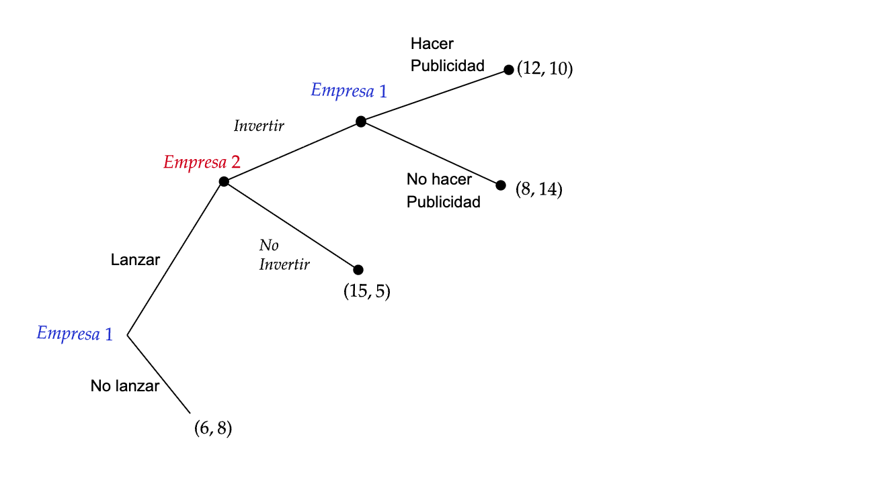

<!-- _class: "title-academic" -->
<!-- _backgroundColor: white -->

Introducción a la Teoría de Juegos

Equilibrio de Nash

Carlos A. Yanes Guerra

Barranquilla, 2025

Universidad del Norte - Departamento de Economía

---
<!-- _class: title -->

# Curso de teoría de **Juegos** 

## Microeconomía II | **Uninorte**

---
<!-- _class: toc  -->

1. [Inicio](#1)
2. [Contenido](#3)
3. [Ingredientes](#7)
4. [Vamos con todo](#11)
5. [Elija](#14)
6. [Tipos de Juego](#24)
7. [Referencias](#30)

---
<!-- _class: "nobrand" -->
<!-- _backgroundImage: url('https://media1.giphy.com/media/v1.Y2lkPTc5MGI3NjExcHdra3d2cWtzM3g5d3JtcnZ3bnpldWh6d3R2NjQ2NThjcTJnOHFpZyZlcD12MV9pbnRlcm5hbF9naWZfYnlfaWQmY3Q9Zw/eq9SCgJK7L5oGQ7FAV/giphy.gif') -->
<!-- _backgroundSize: cover -->
<!-- _backgroundPosition: center -->

---

# Teoría de Juegos vs Teoría de la Decisión

### Optimizando

- Las **personas** tienen objetivos que poseen valor.
- Enfrentamos restricciones
- Cuando se puede, se hace **intercambio**, con el objetivo de maximizar 

### Equlibrios
- Las personas compiten por recursos **escasos**
- Se ajustan (los comportamientos) a partir de los precios.
- Se puede encontrar resultados estables cuando todo ya queda "ajustado".

---
# Estrategía debilmente dominante

- Son aquellas estrategias que aunque aun se tenga presente lo **que haga otro** jugador (contrario), siempre su Utilidad es **mayor o igual** que cualquier otra estrategia del propio jugador.

$$U(s_{i},s_{-i})\geq U(s^{*}_{i},s_{-i})$$

*El signo de la ***desigualdad*** es menos preferente* (A es igual de preferido que B)
    
> Piense en que si a usted le gusta la pizza y la hamburguesa, en algunas ocasiones escogerá pizza.

---
# Ejemplo

# Caso 1

Dos **firmas** compiten en un mercado de `apps` de educación:

- Jugador 1 (Firma A) elige Calidad Alta (H) o Calidad Baja (L).

- Jugador 2 (Firma B) elige Hacer Publicidad (Hacer) o No Publicitar (No Pub).

### Requerimiento
> Muestre que uno de los jugadores $i$, posee al menos una estrategía debilmente dominante.

---

# Ejemplo

<h3 style="text-align:center; color:#000;">Jugador 2</h3>

<table style="margin:auto; border-collapse:collapse; text-align:center; font-size:22px; border:1px solid #000;">
  <tr>
    <th style="border:none;"></th>
    <th style="border:none;"></th>
    <th style="background-color:#c62828; color:white; border:1px solid #000;">Hacer</th>
    <th style="background-color:#c62828; color:white; border:1px solid #000;">No Pub</th>
  </tr>
  <tr>
    <th rowspan="2" style="background-color:#c62828; color:white; border:1px solid #000; padding:5px;">Jugador 1</th>
    <th style="background-color:#c62828; color:white; border:1px solid #000;">H</th>
    <td style="border:1px solid #000; width:100px;">3 , 2</td>
    <td style="border:1px solid #000; width:100px;">4 , 3</td>
  </tr>
  <tr>
    <th style="background-color:#c62828; color:white; border:1px solid #000;">L</th>
    <td style="border:1px solid #000;">3 , 3</td>
    <td style="border:1px solid #000;">2 , 1</td>
  </tr>
</table>
<figcaption align="center"> <i>Matriz de Elección</i> forma normal.</figcaption>
 

¿Dónde está la solución?

---
# Solución

# Observe que
El Jugador 1 posee al menos una estrategía debilmente

 

$$U(H,s_{-i})\geq U(L,s_{-i})$$

- Si suponemos que es *racional* siempre va elegir usar o aplicar la estrategía de alta calidad.

- El resultado va ser el equilibrio: $\{H, No Pub \}$, es decir, $\{4, 3\}$.

---

<!-- _class: chapter -->

# Equilibrio de Nash

## Un concepto poderoso

---

¿Le suena Nash?

---

---

<!-- _footer: Vídeo de la película de Beatifull mind.-->

# Video

<figcaption> Una mente brillante con Russell Crowe.

---

# El Verdadero Nash

## John Forbes Nash (1928–2015)

-  🎓 Matemático estadounidense.
- 🧠 Pionero de la teoría de juegos no cooperativos.
- 📜 Introdujo el concepto de Equilibrio de Nash (1950).
- 🏅 Ganó el Premio Nobel de Economía (1994) junto a Harsanyi y Selten.
- 📊 Su trabajo permitió aplicar la teoría de juegos a economía, política y biología.
- 💭 Sufrió esquizofrenia, relatada en la película A Beautiful Mind (2001).

---

# Noción de Equilibrio de Nash

- Aquella elección que depende de lo **mejor que haga** el otro jugador (contrario), su utilidad es **mayor** que cualquier otra estrategia propiamente suya pero condicionado.

$$U(s_{i},s_{-i})>U(s^{*}_{i},s^{m}_{-i})$$

*El signo de la ***desigualdad*** es preferente* (A es mas preferido que B pero después que el otro jugador hizo lo mejor)
    
> Piense en que si a otra persona tambien le gusta la pizza, usted debe tratar de hacer por obtener el mejor pedazo de pizza que quede o irse por otra mejor opción

---

# Ejemplo: Equilibrio de Nash

<h3 style="text-align:center; color:#000;">Jugador 2</h3>

<table style="margin:auto; border-collapse:collapse; text-align:center; font-size:22px; border:1px solid #000;">
  <tr>
    <th style="border:none;"></th>
    <th style="border:none;"></th>
    <th style="background-color:#c62828; color:white; border:1px solid #000;">Parque</th>
    <th style="background-color:#c62828; color:white; border:1px solid #000;">Cine</th>
  </tr>
  <tr>
    <th rowspan="2" style="background-color:#c62828; color:white; border:1px solid #000; padding:5px;">Jugador 1</th>
    <th style="background-color:#c62828; color:white; border:1px solid #000;">Parque</th>
    <td style="border:1px solid #000; width:100px;">2 , 3</td>
    <td style="border:1px solid #000; width:100px;">0 , 0</td>
  </tr>
  <tr>
    <th style="background-color:#c62828; color:white; border:1px solid #000;">Cine</th>
    <td style="border:1px solid #000;">0 , 0</td>
    <td style="border:1px solid #000;">3 , 2</td>
  </tr>
</table>
<figcaption align="center"> <i>Juego de Sexo.</i> Forma normal.</figcaption>

---

# Ejemplo: Equilibrio de Nash

<h3 style="text-align:center; color:#000;">Jugador 2</h3>

<table style="margin:auto; border-collapse:collapse; text-align:center; font-size:22px; border:1px solid #000;">
  <tr>
    <th style="border:none;"></th>
    <th style="border:none;"></th>
    <th style="background-color:#c62828; color:white; border:1px solid #000;">Parque</th>
    <th style="background-color:#c62828; color:white; border:1px solid #000;">Cine</th>
  </tr>
  <tr>
    <th rowspan="2" style="background-color:#c62828; color:white; border:1px solid #000; padding:5px;">Jugador 1</th>
    <th style="background-color:#c62828; color:white; border:1px solid #000;">Parque</th>
    <td style="border:1px solid #000; width:100px;">
      2 , 3
    </td>
    <td style="border:1px solid #000; width:100px;">0 , 0</td>
  </tr>
  <tr>
    <th style="background-color:#c62828; color:white; border:1px solid #000;">Cine</th>
    <td style="border:1px solid #000;">0 , 0</td>
    <td style="border:1px solid #000;">
      3 , 2
    </td>
  </tr>
</table>

<figcaption align="center"><i>Juego de Sexo.</i> Equilibrio de Nash.</figcaption>

- Note que los equilibrios de NASH se ubican en la parte donde de acuerdo lo que haga un individuo que es lo mejor que puede hacer el **otro**. 

$$EN_{1}= \{3,2 \} \; y \; EN_{2}= \{2,3 \}$$

> Ojo!!! siempre va ser mejor tener una estrategía estricta que depender de **Nash**

---
<!-- _class: title -->

## Ahora preguntemos

### Microeconomía II | **Uninorte**

---
# Caso 1

# Contexto

La existencia de un juego que tiene dos jugadores que se llaman Maria y Andrés. Suponga además que Maria tiene *tres acciones* disponibles: **izquierda, mitad, derecha**. Por tanto su espacio estratégico $S_{M}$ es:

$$S_{M}= \left \{ izquierda, mitad, derecha \right \}$$

Análogamente suponga que Andrés tiene *dos acciones* disponibles. Lo que indica que su espacio estratégico $S_{A}$ es

$$S_{A}= \left \{ Arriba, abajo \right \}$$

---
# Planteamiento estratégico

Si Maria juega $S_{M}=Mitad$ y Andrés escoge $S_{A}=abajo$, el perfil estratégico será:

$$S= \left ( mitad,\ abajo \right )$$

El espacio de todos los perfiles \textbf{estratégico} por ejemplo es:

$$S=S_{M}\;\times\;S_{A}= \left \{ \left( mitad, arriba \right),\left( \dots \right),\left( derecha, arriba \right), \dots   \right \}$$

---
# Volvamos a lo normal

  <b>Interacción</b>

<table style="margin:auto; border-collapse:collapse; text-align:center; font-size:20px; border:1px solid #000; margin-top:5px;">
  <tr>
    <th style="border:none;"></th>
    <th style="border:none;"></th>
    <th colspan="2" style="background-color:#000; color:#fff; border:1px solid #000; text-align:center;"><b>Andrés</b></th>
  </tr>
  <tr>
    <td style="border:none;"></td>
    <td style="border:none;"></td>
    <th style="border:1px solid #000; font-style:italic; background-color:#c62828; color:#fff; padding:6px;">Arriba</th>
    <th style="border:1px solid #000; font-style:italic; background-color:#c62828; color:#fff; padding:6px;">Abajo</th>
  </tr>
  <tr>
    <td rowspan="3" style="border:1px solid #000; font-weight:bold; padding:6px;">María</td>
    <td style="border:1px solid #000; font-style:italic; padding:6px;">Izquierda</td>
    <td style="border:1px solid #000; padding:6px;">2,4</td>
    <td style="border:1px solid #000; padding:6px;">7,1</td>
  </tr>
  <tr>
    <td style="border:1px solid #000; font-style:italic; padding:6px;">Mitad</td>
    <td style="border:1px solid #000; padding:6px;">3,6</td>
    <td style="border:1px solid #000; padding:6px;">3,6</td>
  </tr>
  <tr>
    <td style="border:1px solid #000; font-style:italic; padding:6px;">Derecha</td>
    <td style="border:1px solid #000; padding:6px;">2,8</td>
    <td style="border:1px solid #000; padding:6px;">6,3</td>
  </tr>
</table>

<figcaption align="center" style="font-style:italic; margin-top:6px;">
  Fuente: elaboración propia.
</figcaption>

---
<!-- _class: "white-slide" -->
# Forma Extensiva

---
# Caso 2

Supongamos que la  **Empresa A** y la **Empresa B** compiten en el mismo mercado. Primero, A debe decidir si `lanza` un nuevo producto o si mantiene su línea actual.

Si decide lanzarlo, la empresa B observa esta decisión y puede responder invirtiendo en innovación o manteniendo su estrategia. Ahora bien, si A había lanzado el nuevo producto, puede más adelante decidir si sostiene una campaña publicitaria para impulsarlo o si la cancela dependiendo de la reacción de B.

Los beneficios dependen de todo el camino de decisiones:

- Si A lanza el nuevo producto y luego hace publicidad, y B invierte, entonces A gana 12 y B gana 10.
- Si A lanza pero no hace publicidad, mientras B invierte, A gana 8 y B gana 14.
- Si A lanza, pero B no invierte, A gana 15 y B gana 5.
- En cambio, si A no lanza el nuevo producto, los beneficios se mantienen en 6 para A y 8 para B, ya que nada cambia en el mercado.

---

# Forma Extensiva Caso 2

---
# Solución

Al mirar el `Equilibrio de Nash` vemos que coincide literalmente con el **indicción hacia atras**.

$$EN=\{Lanzar, Invertir, Hacer Publicidad\}$$

---

# Solución espacio estratégico

Ambos jugadores tienen por definir su espacio estratégico.

La **Empresa A** tiene*:

$$S_{A}= \{LHP,LNHP,NLHP, NLNHP\}$$

Para el caso de la **Empresa B**

$$S_{B}=\{Invertir, No\; invertir\}$$

> Aunque esto lo podemos definir por inducción hacia atrás, es mejor plantearlo de forma normal.

<footnote>
* Nota: Hemos resumido el nombre de las estrategias pero note que se múltiplican nodos de decisión.

</footnote>

---
# Espacio normal y equilibrios

---
<!-- _class: "black-slide" -->

---

# Referencias

1. OSBORNE, Martin J.; RUBINSTEIN, Ariel. **A Course in Game Theory**.  
   Cambridge, Massachusetts: MIT Press, 1994.

2. DIXIT, Avinash K.; SKEATH, Susan; REILEY, David H. **Games of Strategy**.  
   5ª edición. New York: W. W. Norton & Company, 2020.

3. WATSON, Joel. **Strategy: an introduction to game theory**.  
  3ª edición. New York: W. W. Norton & Company, 2016.

4. GIBBONS, Robert. **A Primer in Game Theory**.  
   New York: Harvester Wheatsheaf, 1992.

6. STRAUB, Paul G. **Theoretical Foundations of Game Theory**.  
   New York: Springer, 2022.

7. BINMORE, Ken. **Playing for Real: A Text on Game Theory**.  
   Oxford: Oxford University Press, 2007.

8. TUCKER, Albert W. **A Two-Person Dilemma**.  
   In: Kuhn, Harold W.; Tucker, Albert W. (Eds.). *Contributions to the Theory of Games, Vol. 1.*  
   Princeton: Princeton University Press, 1950.

9. SAFNER, Ryan. **Lecture Notes on Game Theory**.  
    Hood College, Department of Economics, 2021.  
    Disponible en: [https://ryansafner.com](https://ryansafner.com)

