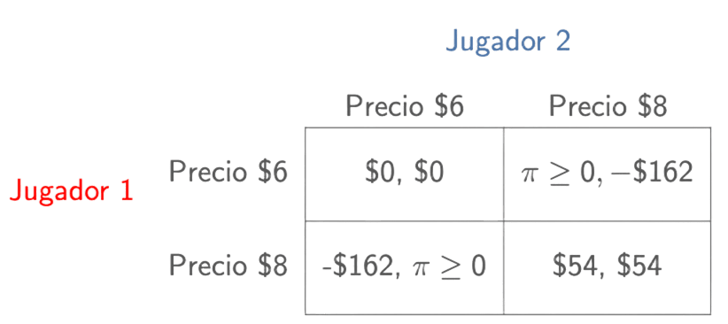
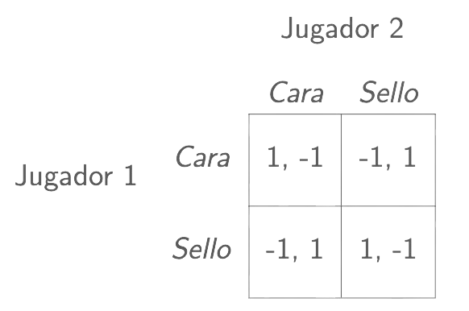
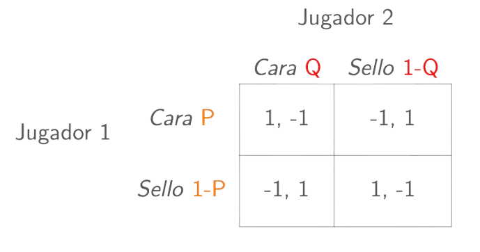

<!-- _class: "title-academic" -->
<!-- _backgroundColor: white -->

Introducción a la Teoría de Juegos

Estrategías Mixtas

Carlos A. Yanes Guerra

Barranquilla, 2025

Universidad del Norte - Departamento de Economía

---
<!-- _class: title -->

# Curso de teoría de **Juegos** 

## Microeconomía II | **Uninorte**

---
<!-- _class: toc  -->

1. [Inicio](#1)
2. [Contenido](#3)
3. [Juego Bertrand](#5)
4. [Juegos Mixtos](#11)
5. [Valor Esperado](#16)
6. [Equilibrio Mixto](#19)
7. [Referencias](#24)

---
<!-- _class: "nobrand" -->
<!-- _backgroundImage: url('https://media0.giphy.com/media/v1.Y2lkPTc5MGI3NjExbmtyOXVleWE0ajF0MGgwMW05dWxmY2ZqdW1xY2tza2tobXYyZHN0OSZlcD12MV9pbnRlcm5hbF9naWZfYnlfaWQmY3Q9Zw/jWK3ykVYW9XFjySTTy/giphy.gif') -->
<!-- _backgroundSize: cover -->
<!-- _backgroundPosition: center -->

Preguntas

---

<!-- _class: chapter -->

# Optimización
## Juego **Bertrand** 

---
# Modelo de Bertrand

- Su exponente **Joseph Bertrand** (1883).

- El producto es `homogéneo`. En lugar de elegir que *cantidad* a producir, las firmas eligen son **precios**.

- El mercado tiende a ser mas `reactivo` y **agresivo**.

---
# Caso Bertrand de Empresa

- Usamos una función de demanda de **mercado**:
  
  $$
  P(Q) = 60 - Q
  $$

- El **costo marginal** es idéntico para ambas firmas, y se asume que es de \$6:
  
  $$
  Cmg_{1} = Cmg_{2} = 6
  $$

- A partir de esto, podemos hacernos varias preguntas:

  **¿Cuál es el equilibrio de Nash?**  
  **¿Qué precio debe elegir cada firma?**

---
# Equilibrio del Mercado

- Cada firma produce hasta el punto en que su **precio es igual al costo marginal**:

  $$
  P = Cmg
  $$

- Usando la función de demanda:
  
  $$
  Q = 60 - P
  $$

- Si $Cmg = 6$, entonces:
  
  $$
  Q = 54 \quad \Rightarrow \quad q^{*}_{1} = q^{*}_{2} = 27
  $$

- La cantidad **total** en el mercado es $Q = 54$.

- El **beneficio** para cada firma es:
  
  $$
  \pi_i = 0
  $$

---
# Nociones

- En equilibrio, las **firmas** producen eficientemente, pero no obtienen beneficios económicos.

- Esto refleja una **competencia perfecta** en un modelo de `Duopolio` pero con precios iguales al costo marginal.

---
# Forma Normal para Bertrand

Donde $\pi \in \left \{ 0, \infty^{+} \right\}$, cualquier precio menor que el que cobre la **competencia** genera múltiples beneficios.

---

<!-- _class: chapter -->

# Lo de Probabilidad
## Veamos **algo** adicional

---
# Juegos Mixtos

- Observe el siguiente juego **matching pennies**

- Este tipo de **juegos** no tiene *equilibrio* de Nash ni de ningún equilibrio aprendido hasta el momento.

---

  ¿ Entonces que hacemos ?

---
# Respuesta

Para el caso planteado, $J_1$ querrá jugar **CARA** si piensa que $J_2$ también lo hace.

- Sin embargo, $J_2$ jugará **CARA** si cree que $J_1$ juega SELLO. Así, $J_1$ debe hacer creer a $J_2$ que jugará SELLO.

- Como no existe coordinación y no será fácil engañar al otro jugador racional, quizás lo mejor que puede hacer cada jugador es hacerlo de forma `aleatoria`.

---
# Estrategías Mixtas

- De hecho, aunque existan Equilibrios de Nash en estrategias puras, quizás los jugadores puedan tener estrategias que jugarán con cierta probabilidad.

- Este tipo de estrategias las denominaremos *estrategias mixtas*: es decir, un jugador puede jugar un perfil de estrategias con cierta probabilidad.

- El concepto de **Equilibrio de Nash** se extiende a mixtas de tal forma que sea un perfil de estrategias $S = (s_{1}, s_{2}, \dots, s_{n})$, donde $S_{i} \in \triangle S_{i}$ para cada jugador $i$. $s$ es un EN en estrategias mixtas si y solo si:
    
$$u_{i} \left( s_{i}, s_{-i} \right) \geq u_{i} \left( s'_{i}, s_{-i} \right) \quad \forall \; s'_{i} \in S \quad \text{y para cada jugador} \; i$$

- La estrategía $s_{i}$ es la mejor respuesta para cualquier estrategia y jugador $i$.

---

<!-- _class: chapter -->

# Equilibrio Mixto
## Uso del **Valor** Esperado

---
# Valor Esperado

> El valor esperado es un concepto fundamental en la teoría de probabilidad y la estadística. Se refiere a la media ponderada de todos los posibles resultados de un experimento aleatorio, donde cada resultado se pondera por su probabilidad de ocurrir. 

- Matemáticamente, el valor esperado $E[X]$ de una variable aleatoria discreta $X$ se define como:

$$E[X] = \sum_{i=1}^{n} x_i P(x_i)$$
    
Donde: $x_i$ son los posibles valores de la variable aleatoria $X$, $P(x_i)$ es la probabilidad de que el valor $x_i$ ocurra, La suma se realiza sobre todos los posibles valores de $X$.

---
# Valor Esperado

- El `valor esperado` tiene diversas interpretaciones según el contexto. En economía, por ejemplo, se interpreta como la cantidad promedio de un valor que se espera obtener en un experimento repetido bajo condiciones de incertidumbre.

---
<!-- _class: chapter -->

# Equilibrio Mixto
## En teoría de **Juegos**

---
# Estructura del Juego Mixto

> P y Q vienen a ser las creencias de lo que posiblemente va jugar el otro jugador.

---
# Qué hace el **Jugador 1**?

- Este jugador hace lo siguiente:

  - Enfrentar estrategía **CARA** vs **SELLO**:
     $$1(Q)+(-1)(1-Q) \geq (-1)(Q)+(1)(1-Q)$$
  - Cuando halla esto encuentra que:
     $$\begin{align*}
         Q-1+Q \geq & -Q + 1 - Q\\
         2Q-1 \geq & -2Q +1 \\
         Q \geq & \frac{2}{4} \Rightarrow Q \geq \frac{1}{2}
     \end{align*}$$

---
# Función de **reacción** Firma 1

De aquí hay que tener en cuenta `lo mejor` que haga el otro jugador. (*La interpretación es clave acá*).

$$\begin{equation*}
        FR_{1}=\left\{\begin{matrix}
P = 1 & \text{si} \; Q> \frac{1}{2} \\ 
P \in \left[0,1 \right] \frac{1}{2} & \text{si y solo si estrategia} \; Q=\frac{1}{2} \\ 
P=0 & \text{si} \; Q < \frac{1}{2}
\end{matrix}\right.
    \end{equation*}$$

*El jugador 1 siempre jugará CARA si sabe que el otro jugador tiene alta probabilidad de jugar CARA.*

---
<!-- _class: "black-slide" -->

---

# Referencias

1. OSBORNE, Martin J.; RUBINSTEIN, Ariel. **A Course in Game Theory**.  
   Cambridge, Massachusetts: MIT Press, 1994.

2. DIXIT, Avinash K.; SKEATH, Susan; REILEY, David H. **Games of Strategy**.  
   5ª edición. New York: W. W. Norton & Company, 2020.

3. WATSON, Joel. **Strategy: an introduction to game theory**.  
  3ª edición. New York: W. W. Norton & Company, 2016.

4. GIBBONS, Robert. **A Primer in Game Theory**.  
   New York: Harvester Wheatsheaf, 1992.

6. STRAUB, Paul G. **Theoretical Foundations of Game Theory**.  
   New York: Springer, 2022.

7. BINMORE, Ken. **Playing for Real: A Text on Game Theory**.  
   Oxford: Oxford University Press, 2007.

8. TUCKER, Albert W. **A Two-Person Dilemma**.  
   In: Kuhn, Harold W.; Tucker, Albert W. (Eds.). *Contributions to the Theory of Games, Vol. 1.*  
   Princeton: Princeton University Press, 1950.

9. SAFNER, Ryan. **Lecture Notes on Game Theory**.  
    Hood College, Department of Economics, 2021.  
    Disponible en: [https://ryansafner.com](https://ryansafner.com)

