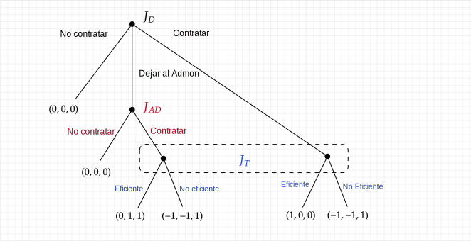
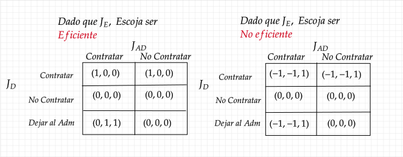
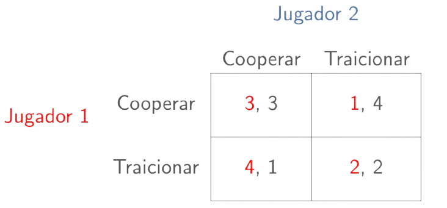
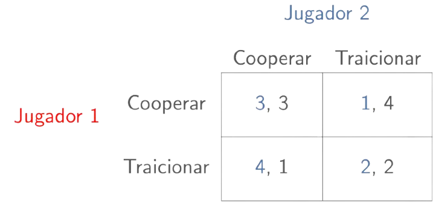

<!-- _class: "title-academic" -->
<!-- _backgroundColor: white -->

Introducción a la Teoría de Juegos

Juegos Evolutivos

Carlos A. Yanes Guerra

Barranquilla, 2025

Universidad del Norte - Departamento de Economía

---
<!-- _class: title -->

# Curso de teoría de **Juegos** 

## Microeconomía II | **Uninorte**

---
<!-- _class: toc  -->

1. [Inicio](#1)
2. [Contenido](#3)
3. [Preguntas](#4)
4. [Juegos extensivos con mas jugadores](#6)
5. [Juegos Evolutivos](#12)
6. [Conclusiones](#27)
7. [Referencias](#31)

---
<!-- _class: "nobrand" -->
<!-- _backgroundImage: url('https://media4.giphy.com/media/v1.Y2lkPTc5MGI3NjExYXlrcnNlNDB5aTNsMXE0cWxqNXZwN3o1dmNwZXdkaHZhbjJnZGtvbyZlcD12MV9pbnRlcm5hbF9naWZfYnlfaWQmY3Q9Zw/LoUpRwmLhTMFZfrrLC/giphy.gif') -->
<!-- _backgroundSize: cover -->
<!-- _backgroundPosition: center -->

Preguntas

---

<!-- _class: chapter -->

# Juegos
## Otras **Extensiones**

---
# Juegos con mas **Jugadores**

- En muchas ocasiones también podemos notar la presencia de mas jugadores en una situación particular.

- Para esos casos, es indispensable establecer que juega cada quien, de que manera lo hace y si poseen o no elementos de información completa.

- Cada jugador puede observar o no los movimientos de los demás jugadores o participantes, observemos el siguiente ejemplo.

---
# Ejemplo

# Caso

Vamos a mirar un caso de *contratación*. Tenemos (3) participantes. Un empresario que desea contratar o no hacerlo pero inclusive dejar que otra persona como un administrador o reclutador la noción de contrato y un aspirante al trabajo que puede ser una persona que puede ser productivo o no serlo y que cuya decisión finalmente puede afectar las utilidades de los demás participantes.

<footnote>

* Nota: Esto tambien se reconoce como un **problema de agencia**

</footnote>

---
# Condiciones

- Un conjunto de jugadores $N = \{J_{1}, J_{2}, J_{3}\}$, donde $J_{1}$ hace claridad sobre `Jugador 1`, $J_{2}$ es el `Jugador 2` y $J_{3}$ el trabajador respectivamente.

- Un **conjunto de acciones** y estrategias de $J_{1}$, $S_{1} = \{C, NC, DA\}$

- Un conjunto de acciones y estrategias de $J_{2}$, $S_{2} = \{ C, NC\}$ 

- Un conjunto de acciones y estrategias de $J_{3}$, $S_{3} = \{ Eficiente, No\;Eficiente\}$

- Ordenes o normas del juego $J_{1}$ empieza el juego y juega de tal manera que sea lo mejor para él. En el caso de $J_{2}$ lo hace siempre y cuando $J_{1}$ así lo disponga. Los pagos de los elementos matriciales hacen parte para $J_{1}$ lo primeros valores, para $J_{2}$ los segundos y para $J_{3}$ el tercero respectivamente.

---

  ¿ Cuál es resultado de eso ?

---
# Forma Extensiva

---
# Forma Normal

---
<!-- _class: chapter -->

# Juegos Evolutivos
## Naturaleza en **grupos** de personas

---
<!-- _class: "quote dark" -->

"Un hombre, por otra parte, mira hacia el **futuro** y hacia el **pasado**, y compara sus diversos sentimientos, deseos y remembranzas. El encuentra, de acuerdo al veredicto de los hombres mas sabios que la mas alta satisfacción se deriva de seguir **ciertos impulsos**, a saber, los instintos sociales. Si el actúa para el bien de los demás, el recibirá la **aprobación** de los demás y ganará el amor de aquellos con quien vive; y esta ultima ganancia será sin duda el placer mayor sobre la tierra”. *Charles Darwin (1876)*

---
# De la **evolución** social

- Hizo investigación para explicar la **evolución** de la cooperación. 
- Utilizar el dilema del prisionero para describir las sociedades humanas y la biología evolutiva de los **comportamientos** animales.
- Organizó una serie de famosos torneos para que los expertos presentaran una estrategia para jugar en un dilema del prisionero repetido innatamente.

<figcaption>Robert Axelrod .</figcaption>

---
# Caso Murcielagos

- Los **murciélagos** vampiro mueren de hambre después de `60 horas`.
- Se alimentan unos a otros regurgitando sangre. 
- Compartir comida es un gran beneficio para el que la recibe, pero un gran costo para el que la proporciona. 
- Wilkinson (1984) demuestra que los murciélagos que **reciben** comida son más propensos a **dar** comida en el futuro. 
- Los murciélagos **comparten** más allá de los simples grupos de parentesco.

---
# El Papel de la evolución

**Evolución**: cambio a lo largo del tiempo de uno o más rasgos heredados en poblaciones de individuos 

> «Si se producen variaciones útiles para cualquier ser orgánico, los individuos así caracterizados tendrán, sin duda, la mejor oportunidad de ser preservados en la lucha por la vida; y por el fuerte principio de la herencia tenderán a producir descendencia con características similares. A este principio de conservación lo he llamado, en aras de la brevedad, Selección Natural» (cap. 4).

<figcaption>Charles Darwin.</figcaption>

---
# Consideraciones generales

- La `selección natural`: La mayor idea de Darwin, principal mecanismo del cambio biológico, requiere: 
        - Variación en los organismos. Reproducción diferencial. 
        - Herencia (replicación) 
        - Aptitud: la capacidad de un replicador para replicarse en comparación con otros tipos Rasgos «más aptos»: con el tiempo se vuelven más comunes en una población de replicadores.

---
<!-- _class: chapter -->

# Juegos Evolutivos
## Estrategias estables evolutivas

---
# Estrategias estables evolutivas

- Considere una población de **cooperantes**:

---
# Estabilidad de Equilibrio

  Tiene que tener en cuenta:

  <box>Mirar pagos</box>
  ⟶
  <box>Halla Nash</box>
  ⟶
  <box>Es estable??</box>

---
# Hagamos el análisis

- Una pequeña fracción $\epsilon$ aparece y que van a **traicionar**.
- Una gran cantidad de individuos aleatorios se reúnen e interactúan
- Probabilidad de jugar contra `cooperante` $1-\epsilon$
- Probabilidad de jugar contra **mutante** $\epsilon$

---
# Van los valores estables

El valor esperado del Cooperador viene a ser:

$$
E[\text{Cooperar}] = 3(1 - \epsilon) + 1(\epsilon) = 3 - 2\epsilon
$$

El valor esperado del Defector es entonces:

$$
E[\text{Traidor}] = 4(1 - \epsilon) + 2(\epsilon) = 4 - 2\epsilon
$$

---
# Buscando un Nash Estable

- Note que el pago de los mutantes es $>$ al pago que reciben los **cooperadores** (Quienes predominan)
- Los ``mutantes`` (higher-fitness) de mayor gravedad (traidores) invadirán con éxito una población de **cooperadores**
- Por tanto, la *cooperación no es EEE*

---

  ¿ Qué ocurre si son traidores?

---

Hay que mirar   "**la caracteristica de todos**"

---
# Valor Esperado del Traidor y del Cooperador

El valor esperado del Traidor viene a ser:

$$
E[\textcolor{blue}{Traicionar}] = \textcolor{blue}{2}(1 - \epsilon) + \textcolor{blue}{4}(\epsilon) = \textcolor{blue}{2 + 2\epsilon}
$$

El valor esperado ahora del mutante Cooperador es:

$$
E[\textcolor{blue}{Cooperador}] = \textcolor{blue}{1}(1 - \epsilon) + \textcolor{blue}{3}(\epsilon) = \textcolor{blue}{1 + 2\epsilon}
$$

---
# Conclusiones del Juego

- Note que el pago de los traidores es $>$ al pago que reciben los cooperadores (quienes ahora quieren invadir).

- Los **cooperadores** de baja aptitud (*lower fitness*) no podrán invadir con éxito una población de traidores.

- Ahora, la traición es un **EEE** (Equilibrio Evolutivamente Estable).

---
# Dilemas Sociales y Estrategias Evolutivas

- Las sociedades pueden vivir dilemas como el de los **prisioneros**.

- Si todos somos colaboradores $\succ$ todos somos traidores:

  - La **cooperación** no es un (EEE): un simple *traidor* puede explotar un mundo de colaboradores (*cooperantes*).

  - La traición es un (EEE).  
    ¡Es peligroso ser el único cooperador en un mundo de traidores!

---
<!-- _class: "quote dark" -->

"Puedo imaginar en mi mente un mundo sin guerra, un mundo sin odio. Y puedo imaginarnos atacando ese mundo porque nunca lo esperarían" - Jack Handey 

---

<!-- _class: "black-slide" -->

---

# Referencias

1. OSBORNE, Martin J.; RUBINSTEIN, Ariel. **A Course in Game Theory**.  
   Cambridge, Massachusetts: MIT Press, 1994.

2. DIXIT, Avinash K.; SKEATH, Susan; REILEY, David H. **Games of Strategy**.  
   5ª edición. New York: W. W. Norton & Company, 2020.

3. WATSON, Joel. **Strategy: an introduction to game theory**.  
  3ª edición. New York: W. W. Norton & Company, 2016.

4. GIBBONS, Robert. **A Primer in Game Theory**.  
   New York: Harvester Wheatsheaf, 1992.

6. STRAUB, Paul G. **Theoretical Foundations of Game Theory**.  
   New York: Springer, 2022.

7. BINMORE, Ken. **Playing for Real: A Text on Game Theory**.  
   Oxford: Oxford University Press, 2007.

8. TUCKER, Albert W. **A Two-Person Dilemma**.  
   In: Kuhn, Harold W.; Tucker, Albert W. (Eds.). *Contributions to the Theory of Games, Vol. 1.*  
   Princeton: Princeton University Press, 1950.

9. SAFNER, Ryan. **Lecture Notes on Game Theory**.  
    Hood College, Department of Economics, 2021.  
    Disponible en: [https://ryansafner.com](https://ryansafner.com)

